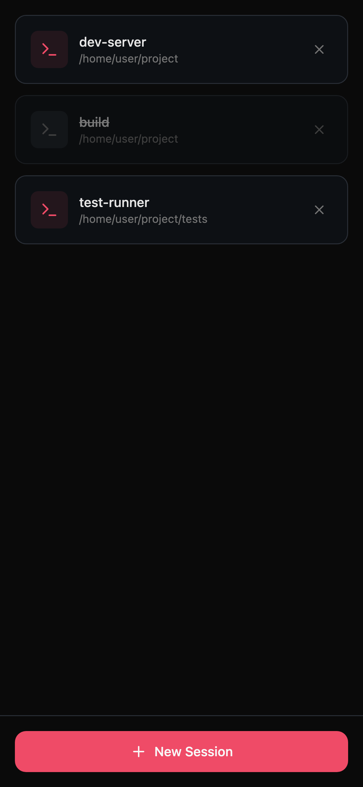
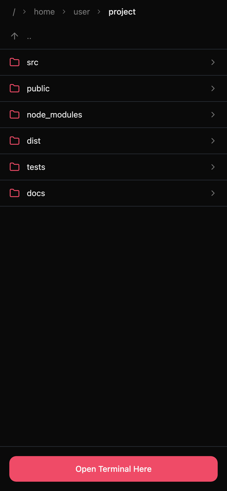
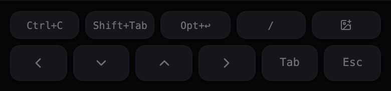

<div align="center">

# Better Remote Control

**내 로컬 터미널을, 내 폰에서.**

Cloudflare Tunnel 기반 모바일 최적화 웹 터미널.\
[Claude Code](https://docs.anthropic.com/en/docs/claude-code) 같은 CLI 도구를 어디서든 쓸 수 있습니다.

<br>

<a href="README.md">English</a>

<br>



</div>

---

## 왜 만들었나?

[Claude Code Remote Control](https://github.com/anthropics/claude-code)은 불안정합니다. 대체제를 찾아봤지만 불필요한 기능이 많거나 버그투성이였습니다. 그래서 **brc**를 직접 만들었습니다 — 로컬 터미널을 폰에 띄우는 것, 그 하나에만 집중한 도구입니다.

## 시작하기

```bash
git clone https://github.com/custardcream98/better-remote-control.git
cd better-remote-control
pnpm install && pnpm run build
pnpm start
```

터미널에 QR 코드가 나타나면 폰으로 스캔하고, 비밀번호를 입력하면 끝입니다.

## 기능

<table>
<tr>
<td width="50%">

### 멀티 세션

여러 터미널 세션을 동시에 사용할 수 있습니다. 파일 브라우저에서 작업 디렉토리를 선택해 세션을 시작합니다.

</td>
<td width="50%">



</td>
</tr>
<tr>
<td width="50%">



</td>
<td width="50%">

### 모바일 특수 키

터미널 사용에 최적화된 키 배열:

- <kbd>Ctrl</kbd> <kbd>Alt</kbd> <kbd>Tab</kbd> <kbd>Esc</kbd> — 스티키 토글
- <kbd>←</kbd> <kbd>↓</kbd> <kbd>↑</kbd> <kbd>→</kbd> — 길게 누르면 반복
- <kbd>Opt+Enter</kbd> <kbd>|</kbd> <kbd>/</kbd> <kbd>~</kbd> <kbd>$</kbd> <kbd>\_</kbd>

</td>
</tr>
<tr>
<td width="50%">

### 이미지 업로드

카메라나 갤러리에서 이미지를 선택하면 서버에 업로드되고, 파일 경로가 터미널에 자동 삽입됩니다. Claude Code에 이미지를 넘길 때 유용합니다.

</td>
<td width="50%">

### 슬립 방지

`caffeinate`로 맥북을 깨워둡니다. 덮개를 닫아도 터미널이 계속 실행됩니다.

> 전원 연결 필요.

</td>
</tr>
</table>

### 자동 재연결

연결이 끊겨도 자동으로 재접속하며 터미널 히스토리를 그대로 복원합니다. 출력이 유실되지 않습니다.

### 보안

비밀번호 인증, 속도 제한 (5회 / 60초), CSRF 보호, timing-safe 비교. 인증 토큰은 `HttpOnly` + `SameSite=Strict` 쿠키로 관리됩니다.

## 사용법

```bash
brc [옵션]
```

| 옵션                  | 설명                                |
| --------------------- | ----------------------------------- |
| `-p, --port <port>`   | 포트 번호 (기본: `4020`)            |
| `--password <pw>`     | 비밀번호 지정 (기본: 자동 생성)     |
| `-s, --shell <shell>` | 쉘 경로 (기본: `$SHELL`)            |
| `-c, --cwd <dir>`     | 기본 작업 디렉토리 (기본: `$HOME`)  |
| `--command <cmd>`     | 세션 시작 시 자동 실행할 명령어     |
| `--no-tunnel`         | Cloudflare Tunnel 비활성화 (로컬만) |
| `--no-caffeinate`     | 슬립 방지 비활성화                  |

<details>
<summary><b>사용 예시</b></summary>

```bash
# Claude Code 원격 실행
brc --command "claude --dangerously-skip-permissions"

# 특정 프로젝트에서 시작
brc --cwd ~/my-project

# 로컬 네트워크만 (터널 없이)
brc --no-tunnel

# 비밀번호 직접 지정
brc --password mysecretpassword
```

</details>

## 사전 요구사항

| 요구사항          | 설치                                        |
| ----------------- | ------------------------------------------- |
| **Node.js** >= 18 | [nodejs.org](https://nodejs.org)            |
| **pnpm**          | `npm install -g pnpm`                       |
| **cloudflared**   | `brew install cloudflared` (터널 사용 시만) |

## 라이선스

MIT
