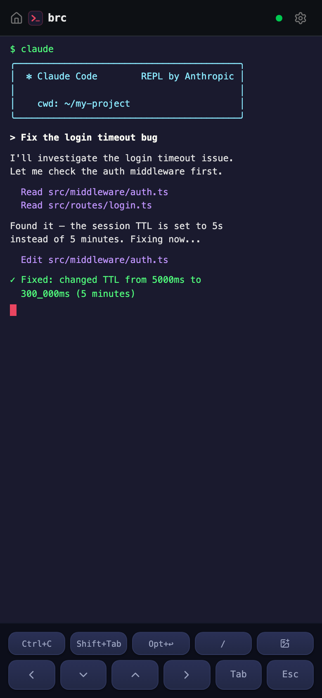
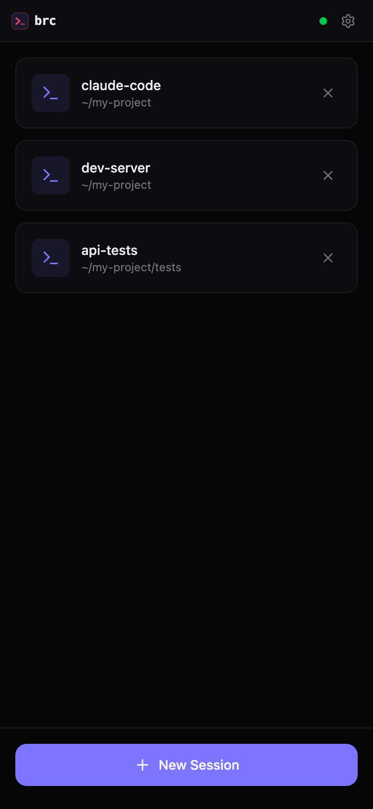

<div align="center">


# Better Remote Control

**Your local terminal, on your phone.**

A lightweight, mobile-first web terminal powered by Cloudflare Tunnel.\
Built for running [Claude Code](https://docs.anthropic.com/en/docs/claude-code) from anywhere.

<br>

<a href="README.ko.md">한국어</a>

<br>



</div>

---

## Why?

[Claude Code Remote Control](https://github.com/anthropics/claude-code) is unstable. Every alternative I tried was either bloated with unnecessary features or riddled with bugs. So I built **brc** — a focused tool that does one thing well: puts your local terminal on your phone.

## Quick Start

### Install (no Node.js required)

```bash
curl -fsSL https://raw.githubusercontent.com/custardcream98/better-remote-control/main/install.sh | sh
```

Or download a standalone binary from [GitHub Releases](https://github.com/custardcream98/better-remote-control/releases).

### With npm

```bash
npx better-remote-control
```

### From source

```bash
git clone https://github.com/custardcream98/better-remote-control.git
cd better-remote-control
pnpm install && cd client && pnpm install && cd ..
pnpm run build && pnpm start
```

A QR code appears in your terminal. Scan it, enter the password, and you're in.

## Features

<table>
<tr>
<td width="50%">


</td>
<td width="50%">

### Run Claude Code Remotely

Control your local Claude Code session from anywhere — on the couch, in bed, on the go. All you need is a phone and a browser.

</td>
</tr>
<tr>
<td width="50%">

### Multi-Session Terminals

Run multiple sessions side by side — Claude Code in one, dev server in another, tests in a third. Switch between them with a tap.

</td>
<td width="50%">



</td>
</tr>
<tr>
<td width="50%">


</td>
<td width="50%">

### Mobile-Optimized Keyboard

Quick keys designed for thumb accessibility:

- <kbd>←</kbd> <kbd>↓</kbd> <kbd>↑</kbd> <kbd>→</kbd> <kbd>Tab</kbd> <kbd>Esc</kbd> — bottom row, easy reach
- <kbd>Ctrl+C</kbd> <kbd>⇧Tab</kbd> <kbd>Opt+↵</kbd> <kbd>/</kbd> — top row, auxiliary
- Arrow keys support long-press to repeat

</td>
</tr>
</table>

### Image Upload

Upload images from your camera or gallery directly into the terminal. The file path is automatically inserted — perfect for passing images to Claude Code.

### Always On

Keeps your Mac awake with `caffeinate` — close the lid, and your terminal keeps running. Requires power connection.

### Auto-Reconnect

Lost connection? brc automatically reconnects and restores your full terminal history. No output is lost.

### Secure by Default

Password authentication with rate limiting (5 attempts / 60s), CSRF protection, and timing-safe comparison. Auth tokens are `HttpOnly` + `SameSite=Strict`.

## Usage

```bash
brc [options]
```

| Option                | Description                                     |
| --------------------- | ----------------------------------------------- |
| `-p, --port <port>`   | Port number (default: `4020`)                   |
| `--password <pw>`     | Set password manually (default: auto-generated) |
| `-s, --shell <shell>` | Shell path (default: `$SHELL`)                  |
| `-c, --cwd <dir>`     | Default working directory (default: `$HOME`)    |
| `--command <cmd>`     | Auto-execute command on session start           |
| `--no-tunnel`         | Disable Cloudflare Tunnel (local only)          |
| `--no-caffeinate`     | Disable sleep prevention                        |

<details>
<summary><b>Examples</b></summary>

```bash
# Run Claude Code remotely
brc --command "claude --dangerously-skip-permissions"

# Start in a specific project
brc --cwd ~/my-project

# Local network only (no tunnel)
brc --no-tunnel

# Custom password
brc --password mysecretpassword
```

</details>

## Prerequisites

**cloudflared** is required for remote access via Cloudflare Tunnel:

```bash
brew install cloudflared   # macOS
# or see https://developers.cloudflare.com/cloudflare-one/connections/connect-networks/downloads/
```

Without cloudflared, brc still works on your local network with `--no-tunnel`.

<details>
<summary><b>Building from source</b></summary>

| Requirement       | Install                          |
| ----------------- | -------------------------------- |
| **Node.js** >= 18 | [nodejs.org](https://nodejs.org) |
| **pnpm**          | `npm install -g pnpm`            |

</details>

## License

MIT
